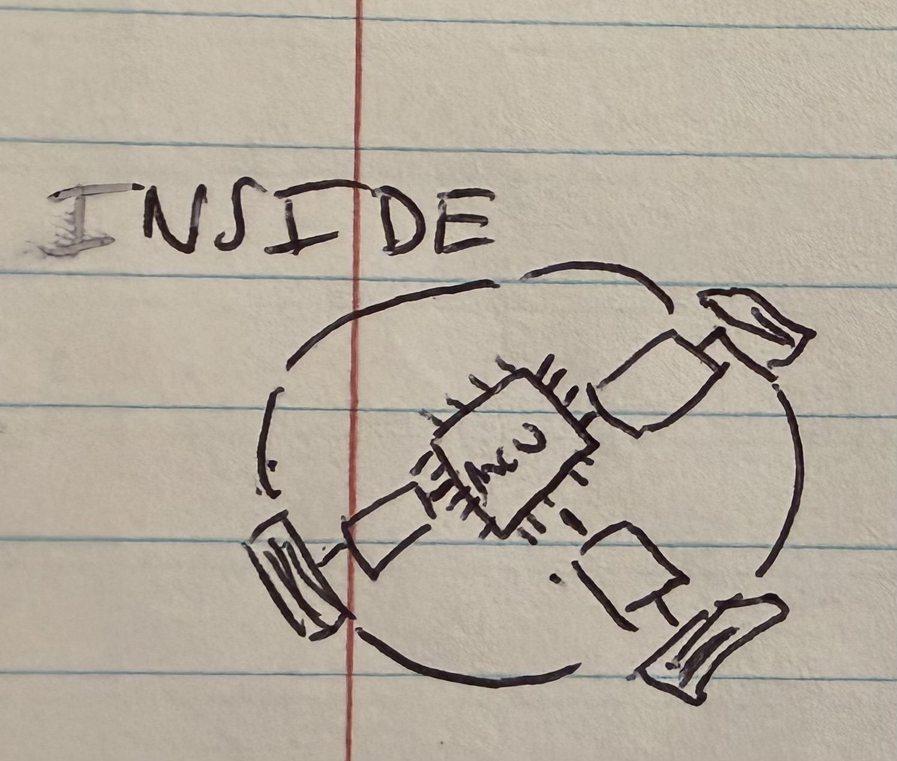
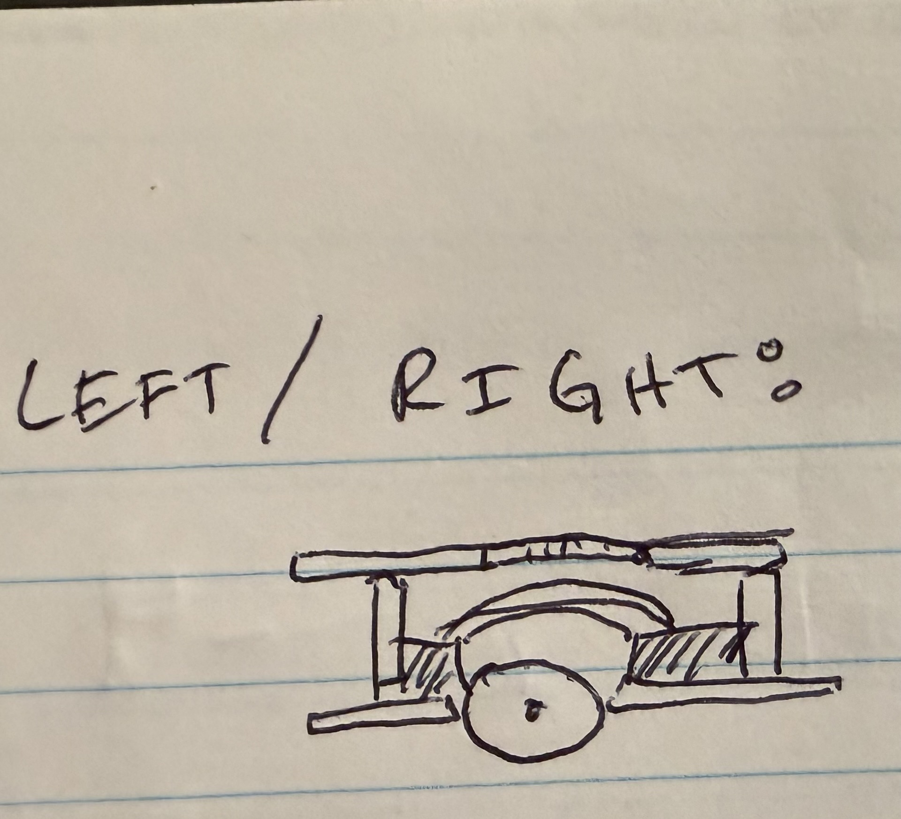
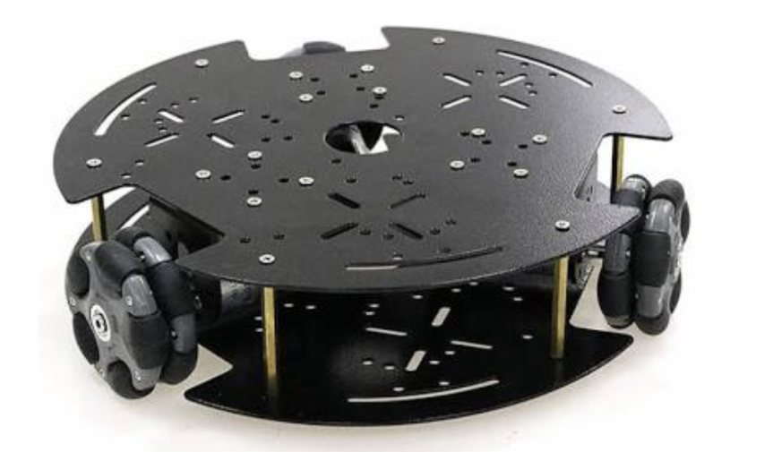

# ESE3500_Final_Proposal: 
# NOTE TO GRADERS: We had an initial issue with repo creation, so the professor told us to do this on our own rep
## members: David Aquino, Alexander Freeman, Anil Ghosh, Lucas Krippendorff

## 1) Abstract: 
Our project is a game in which an RC car navigates an obstacle course. The car will communicate wirelessly with the controller and have the hardware to detect collisions with surrounding objects. The game will end if a certain number of collisions are detected by the car. An onboard timer determines whether you complete the obstacle course in time.

## 2) Motivation: 
Our design is a game system intended to function as entertainment. The standout feature of our project is the wireless communication between the two MCUs, one in the controller and one in the car. Additionally, we will tune the accelerometer sensing in order to differentiate between breaking and colliding with walls or other obstacles . This way, we get videogame-like mechanics in a real setup with a robot in a physical environment. 

## 3) System Block Diagram:

## 4) Design Sketches:

Depending on the material used, we may need a laser cutter or 3d printing, although basic prototyping can be done with cardboard. 

With regards to critical design features, the primary ones are the holes for the wheels and the pillars to give space for the motors and circuitry. 

## 5) Software Requirements Specification (SRS): 

1) Remote Drive Response: The vehicle shall respond to valid remote control drive commands within 100 ms of transmission, including forward, reverse, left, right, and stop commands. Validation: Timestamp controller transmission and observed motor actuation using serial logs and/or video frame analysis.

2) Continuous Motor and Steering Control: The firmware shall update motor speed and steering control signals at a rate of at least 20 Hz during active vehicle operation. Validation: Measure PWM/control signal update timing with an oscilloscope or logic analyzer while the car is being driven.

3) Crash Detection Using Accelerometer: The system shall detect a crash event when the accelerometer measures an acceleration magnitude above a defined threshold and shall register that event within 150 ms. Validation: Perform controlled collision tests and compare raw accelerometer readings to the crash event flag recorded by the firmware.

4) Crash Response and Safety State: After detecting a valid crash event, the system shall enter a crash-response state within 250 ms, including stopping or limiting the vehicle and activating status feedback. Validation: Trigger controlled impacts and measure the delay between threshold crossing and the resulting stop/penalty behavior.

5) User Feedback on Vehicle Status: The system shall provide visible or audible feedback to indicate at least the following states: normal operation, crash detected, and reset/ready state. Validation: Test each operating condition individually and verify that the correct LED, buzzer, or display output is produced.

6) Post-Crash Reset Behavior: After a crash event, the system shall remain in the crash-response state until a valid reset command iss received, after which the vehicle shall return to normal operation within 500 ms. Validation: Simulate crash events, issue reset commands, and verify through logs and observation that the system resumes normal behavior within the required time.

## 6) Hardware Requirements Specification (HRS):

1) Drive Motor Actuation: The vehicle shall include a motor drive subsystem capable of driving the car forward and reverse across a flat indoor surface under onboard power. Validation: Test the car on a flat surface and verify successful forward and reverse motion over a fixed distance.

2) Steering Mechanism: The vehicle shall include a steering mechanism that enables controlled left and right turning during remote operation. Validation: Command left and right turns and verify directional change through observed turning maneuvers or measured turning radius.

3) Accelerometer-Based Crash Sensing: The system shall include an accelerometer connected through an I2C or SPI interface to measure vehicle acceleration for crash detection. Validation: Verify sensor communication by reading live acceleration data and confirming that impact events produce measurable changes.

4) Status Feedback Hardware: The vehicle shall include at least one physical status indicator, such as an LED, buzzer, or display, to communicate normal operation and crash state to the user. Validation: Trigger each system state and verify that the corresponding hardware indicator activates correctly.

5) Wireless or Remote Control Interface: The vehicle shall include a remote control interface that allows a user to command at minimum forward, reverse, left, right, and stop functions. Validation: Test each control input individually and verify that the corresponding vehicle action occurs.

6) Regulated Power Distribution: The vehicle shall include a power subsystem that provides separate or properly regulated power for logic/sensing components and motor actuation components. Validation: Measure supply voltages under idle and active driving conditions and verify that logic voltage remains within the acceptable operating range while motors are running.

## 7) Bill of Materials (BOM): 

[click for spreadsheet](https://docs.google.com/spreadsheets/d/1tswUpjjSOV8vyMNagtu2i6aR_z83_FL3piSMzd2DsaQ/edit?gid=253149064#gid=253149064)

BOM:

Remote:
- ATmega328PB
- NRF24L01 transceiver module
- Thumbstick potentiometer (x2)
- Start/reset button
- 7-segment or small numeric display (timer readout)
- AA battery pack + holder

Car:
- ATmega328PB
- NRF24L01 transceiver module
- Mecanum wheel chassis
- DC gear motors (x4)
- H-bridge motor driver (x4, or dual H-bridge x2)
- MPU-6050 accelerometer
- SPST toggle switch (practice mode)
- LEDs (x2)
- AA battery pack + holder

## 8) Final Demo: 

On demo day, the project will be demonstrated using two small RC cars operating on the floor in an open indoor space such as a classroom or lab area. One car will act as the chaser and the other as the runner. Each vehicle will be controlled by a player using its control interface. During the demonstration, the runner will attempt to avoid the chaser while moving around the designated area, while the chaser will attempt to approach the runner and trigger a tag event by entering a predefined proximity range. When the tag condition is met, the runner vehicle will automatically enter a disabled state where its motors stop and a visual or audible indicator (such as an LED or buzzer) signals the tag event. The demonstration will require approximately 2–3 meters of open floor space and will last about one to two minutes, allowing time to show vehicle movement, proximity detection, and the tag response. The cars will be powered by onboard batteries and will include a reset mechanism so the demonstration can be quickly repeated if needed. This setup highlights the integration of sensing, motor control, and embedded game logic within the system.

## 9) Sprint Planning:

[spread sheet link](https://docs.google.com/spreadsheets/d/1aMgzzJ2PiYqlZypGd8MVPJMgWRnupPE3UgLq3mdljGI/edit?gid=0#gid=0)

In the first sprint, the team will focus on establishing the basic hardware platform, including setting up the microcontroller boards, power systems, and motor drivers, and writing initial firmware to verify that both vehicles can drive using PWM motor control. The second sprint will focus on implementing the proximity sensing subsystem and verifying that the microcontroller can accurately detect objects within the required tag range. During the third sprint, the team will implement the core game logic, including tag detection, timing conditions, and the disabled state for the tagged vehicle, along with visual or audible feedback. The fourth sprint will focus on integrating all subsystems together, including user input, sensing, motor control, and game logic, followed by extensive testing and debugging. In the final sprint, the team will refine system behavior, improve reliability, and prepare the final demonstration and documentation.

Work will be distributed across the team based on major subsystems of the project. One team member will focus on motor control and vehicle movement firmware, another will develop the proximity sensing and tag detection algorithms, a third member will handle hardware integration including wiring, power regulation, and sensor mounting, and the fourth member will focus on system integration, testing, and debugging. All team members will collaborate during integration and testing phases to ensure that the two vehicles interact correctly and the overall gameplay functions reliably.

